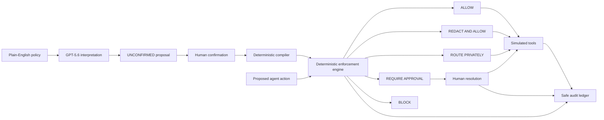

<div align="center">

# BOUNDARY

### AI that asks before it acts.

A deterministic policy and approval layer for AI agents. BOUNDARY converts plain-English company rules into enforceable decisions—**allow, redact, route privately, require approval, or block**—with a human-controlled confirmation step and a complete audit trail.

[](https://boundary-ai-agent-control.vercel.app)
[](https://openai.com/)
[](./CODEX_COLLABORATION.md)
[](https://nextjs.org/)
[](https://www.typescriptlang.org/)
[](#verification)
[](#hackathon-submission)

[Live Demo](https://boundary-ai-agent-control.vercel.app) ·
[Documentation](./docs/README.md) ·
[Judge Testing Guide](./docs/JUDGE_TESTING.md) ·
[Architecture](./docs/ARCHITECTURE.md) ·
[Threat Model](./docs/THREAT_MODEL.md) ·
[Deployment](./docs/DEPLOYMENT.md)

</div>

---

## Why BOUNDARY

AI agents increasingly propose refunds, send messages, process records, call tools, and update systems. Prompt instructions alone are not a reliable authorization boundary.

BOUNDARY places a deterministic control layer between an agent's proposed action and its simulated execution:

1. GPT-5.6 produces a strict, **non-authoritative** interpretation proposal.
2. A human reviews and confirms the policy.
3. Deterministic code compiles the confirmed policy.
4. The enforcement engine evaluates every proposed action.
5. Only simulated tools can execute in this hackathon demo.
6. Safe audit events record the decision path.

> **Core principle:** model output may interpret and suggest; it cannot authorize, approve, write authoritative audit events, or invoke tools.

## Decisions

| Decision             | Meaning                                        | Example                                 |
| -------------------- | ---------------------------------------------- | --------------------------------------- |
| **ALLOW**            | Action is permitted by the confirmed policy    | Small refund within the automatic limit |
| **REDACT_AND_ALLOW** | Sensitive fields are removed before processing | Cloud action containing synthetic PII   |
| **ROUTE_PRIVATELY**  | Action must use an approved private path       | Sensitive transcript handling           |
| **REQUIRE_APPROVAL** | Exact action pauses for a human decision       | INR 7,500 refund or external email      |
| **BLOCK**            | Action is prohibited                           | Attempt to delete the audit history     |

## Judge-ready workflow

1. Open the [live demo](https://boundary-ai-agent-control.vercel.app).
2. Keep **Demo fixture** selected.
3. Interpret the supplied company policy.
4. Review the `UNCONFIRMED` structured proposal.
5. Enter a reviewer identity and confirm the policy.
6. Test safe refund, large refund, PII cloud action, private transcript, external email, and blocked deletion.
7. Approve or reject the INR 7,500 refund.
8. Continue the exact approved action and inspect the audit timeline.
9. Run **Try to Break My Policy**.
10. Reset the session and repeat.

No account or credentials are required. All records, refunds, emails, approvals, and tools are synthetic or simulated.

## Public deployment status

The public Vercel deployment intentionally defaults to **Demo fixture** and currently reports Live GPT-5.6 as unavailable. The official server-only Responses API adapter remains implemented, but no funded API quota is attached to the public deployment. Judges can run the complete policy, approval, adversarial-analysis, and audit workflow without credentials.

No OpenAI key is committed, exposed to client code, included in documentation, or stored in Git. Enabling the optional live path later requires only a funded server-side `OPENAI_API_KEY`; no enforcement-code change is required.

## Architecture



### Authority boundaries

- **GPT-5.6:** bounded policy interpretation and adversarial suggestion generation.
- **Human reviewer:** confirms a policy and resolves approval requests.
- **Deterministic code:** policy compilation, enforcement, action transformation, replay protection, approval binding, and audit creation.
- **Simulated tools:** side-effect-free demonstration only.

## Features

- Strict Zod schemas and structured OpenAI Responses API output
- Human confirmation before a model-generated interpretation can become active
- Five deterministic enforcement outcomes
- Approval records bound to the exact action and policy version
- Redaction and private-routing transformations
- Idempotent continuation and replay protection
- Adversarial policy testing with bounded fixtures
- Redis-backed production demo sessions with TTL and safe reset
- Request size limits, bounded throttling, safe errors, and security headers
- No client-side credentials
- No Chat Completions, custom provider proxy, or localhost model gateway

## Stack

| Layer               | Technology                                             |
| ------------------- | ------------------------------------------------------ |
| Application         | Next.js App Router, React                              |
| Language            | TypeScript in strict mode                              |
| UI                  | Tailwind CSS                                           |
| Validation          | Zod                                                    |
| AI                  | Official OpenAI JavaScript SDK, Responses API, GPT-5.6 |
| Session persistence | Upstash Redis / Vercel KV REST compatibility           |
| Testing             | Vitest                                                 |
| Deployment          | Vercel                                                 |
| Package manager     | npm                                                    |

## Local setup

### Requirements

- Node.js **22.x**
- npm
- An OpenAI API key only for optional Live GPT-5.6 mode

```powershell
git clone git@github.com:kaulastudies/boundary-ai-agent-control.git
cd boundary-ai-agent-control
npm ci
Copy-Item .env.example .env.local
npm run dev
```

Open `http://localhost:3000`.

Demo fixture mode works without environment variables. Keep real values only in ignored local files or server-side deployment settings.

### Environment variables

```text
OPENAI_API_KEY=
OPENAI_MODEL=gpt-5.6

UPSTASH_REDIS_REST_URL=
UPSTASH_REDIS_REST_TOKEN=
```

Production also accepts the existing Vercel KV aliases:

```text
KV_REST_API_URL=
KV_REST_API_TOKEN=
```

The Upstash names take precedence when both pairs exist. No credential is exposed to client code.

## Commands

```text
npm run dev
npm run format
npm run format:check
npm run docs:check
npm run lint
npm run typecheck
npm test
npm run build
npm start
```

## Verification

Current verified release:

- **89 automated tests passing**
- Documentation and link audit passing
- Public no-key judge path passing
- Live availability intentionally reports `false`
- ESLint passing
- TypeScript typecheck passing
- Next.js production build passing
- Live health endpoint passing
- Redis-backed production session creation passing
- Production session reset passing

Tests use fakes for OpenAI and make zero live provider calls.

## Production routes

| Route                     | Method | Purpose                               |
| ------------------------- | ------ | ------------------------------------- |
| `/`                       | GET    | Judge-ready BOUNDARY workspace        |
| `/api/health`             | GET    | Minimal `{ "status": "ok" }` response |
| `/api/policies/interpret` | GET    | Safe Live GPT-5.6 availability check  |
| `/api/policies/interpret` | POST   | Bounded server-only interpretation    |
| `/api/demo/workspace`     | POST   | Deterministic session workflow        |

## Security and privacy

- Default deny for unmatched risk
- Model output is non-authoritative
- Human confirmation is explicit
- Approval binds to an exact action and policy version
- Sensitive values are excluded from safe errors and audit snapshots
- Credentials remain server-side
- Production never falls back silently from Redis to process memory
- Live GPT-5.6 never silently falls back to fixture mode
- All tools are simulated; no payment, email, CRM, or customer system is connected

See the concise [threat model](./docs/THREAT_MODEL.md) for remaining demo limitations.

## How Codex and GPT-5.6 were used

### Codex

Codex was the primary engineering environment for:

- repository foundation and architecture
- deterministic policy engine
- human confirmation and approvals
- simulated tools and audit ledger
- official Responses API integration
- adversarial testing
- judge-facing UI
- deployment hardening
- tests, documentation, and production verification

The implementation history and collaboration notes are recorded in [CODEX_COLLABORATION.md](./CODEX_COLLABORATION.md) and [HACKATHON_CHANGELOG.md](./HACKATHON_CHANGELOG.md).

### GPT-5.6

GPT-5.6 is used for two bounded language tasks:

1. Convert plain-English policy into a strict, non-authoritative structured proposal.
2. Suggest adversarial scenarios for human review and deterministic testing.

GPT-5.6 cannot activate a policy, approve an action, execute a tool, or become the final enforcement authority.

## Project structure

```text
src/
|-- adapters/
|   |-- openai/        Official SDK and Responses API boundary
|   |-- tools/         Side-effect-free simulated tools
|   `-- upstash/       Production session repository
|-- app/api/           Health, interpretation, and workspace routes
|-- application/       Confirmation, approvals, control flow, audit, sessions
|-- domain/            Schemas and deterministic enforcement
|-- fixtures/          Synthetic demo policies, actions, and adversarial cases
`-- components/        Judge-ready workspace UI

tests/
|-- fakes/             Provider and repository fakes
`-- unit/              Deterministic unit and route tests
```

## Team and final ownership

- **Rama Chandra M** - project lead; architecture, deterministic engine, OpenAI integration, deployment, submission, final QA, documentation, and release evidence.
- **Naboth Daniel** - teammate and project participant; included in the team record and invited to support QA and documentation.
- With the final deadline approaching, Rama completed the remaining tracked judge-readiness tasks directly so the submission would not be delayed.

| Task                                                                                                             | Final status      |
| ---------------------------------------------------------------------------------------------------------------- | ----------------- |
| [Cross-browser and mobile judge QA](https://github.com/kaulastudies/boundary-ai-agent-control/issues/1)          | Completed by Rama |
| [Final screenshots and Devpost verification](https://github.com/kaulastudies/boundary-ai-agent-control/issues/2) | Completed by Rama |
| [README and judge-instructions review](https://github.com/kaulastudies/boundary-ai-agent-control/issues/3)       | Completed by Rama |
| [Final live regression evidence](https://github.com/kaulastudies/boundary-ai-agent-control/issues/4)             | Completed by Rama |

Evidence: [**Final Judge QA Report**](./docs/evidence/final-qa/FINAL_QA_REPORT.md)

Milestone: [**Post-submission polish - Judge readiness**](https://github.com/kaulastudies/boundary-ai-agent-control/milestone/1)

## License

BOUNDARY is available under the [MIT License](./LICENSE).

## Hackathon submission

BOUNDARY was built for **OpenAI Build Week 2026** in the **Work & Productivity** category.

- Live demo: https://boundary-ai-agent-control.vercel.app
- Repository: https://github.com/kaulastudies/boundary-ai-agent-control
- Feedback ID: `019f644d-5b46-71f1-93f9-20c4e49f8ad3`

---

<div align="center">

**BOUNDARY: AI that asks before it acts.**

</div>
